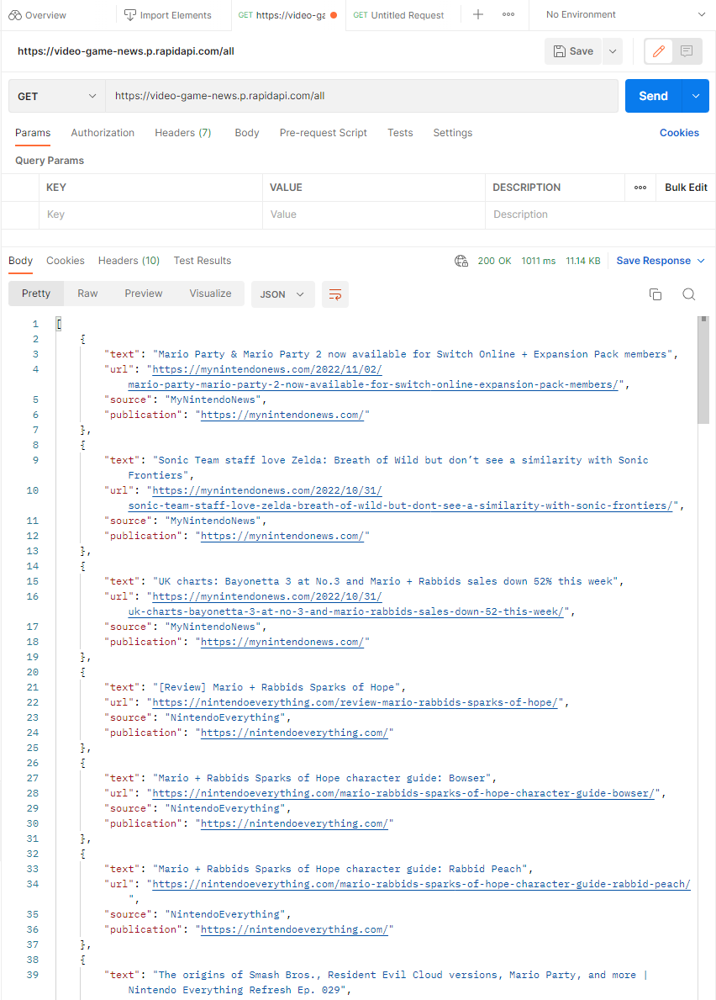
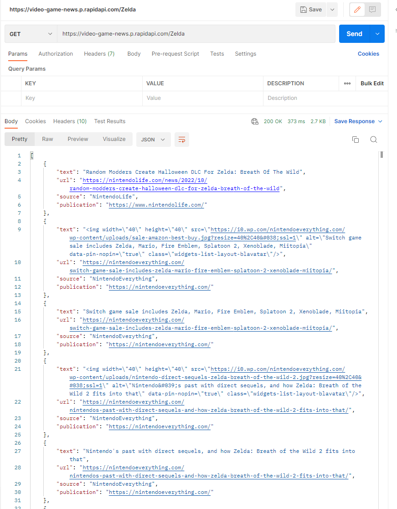
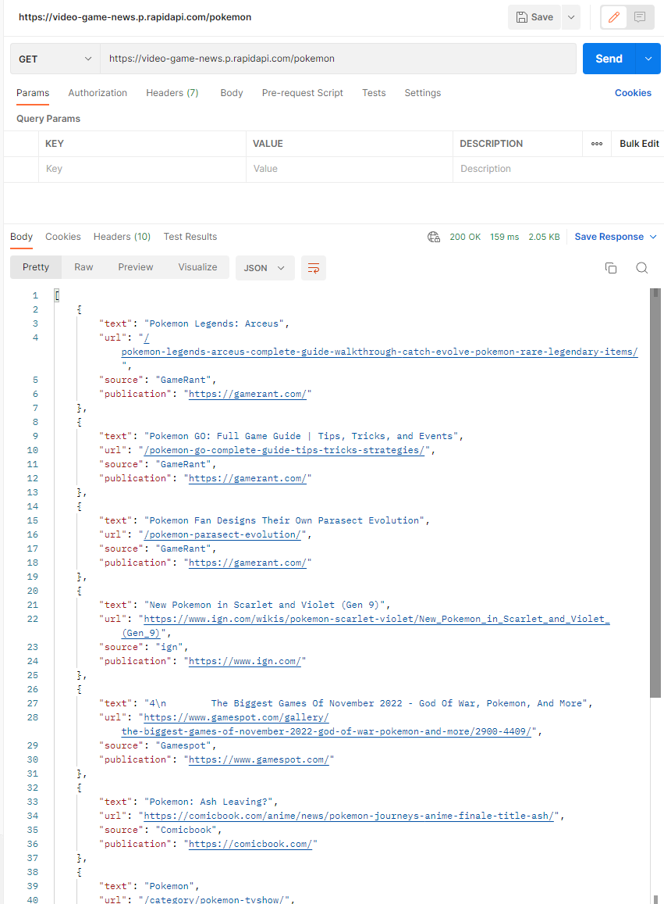
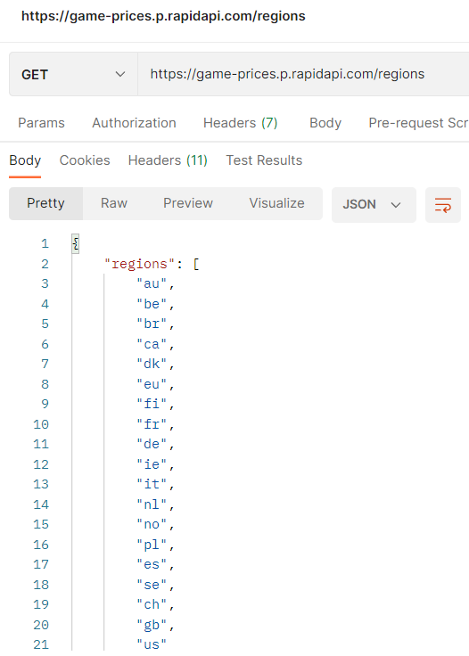
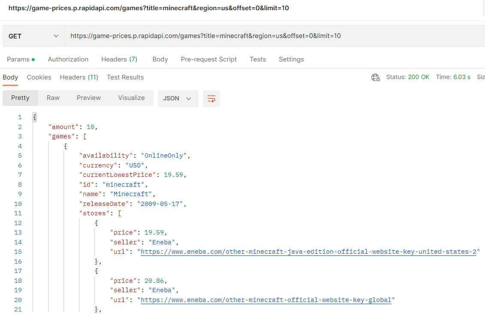
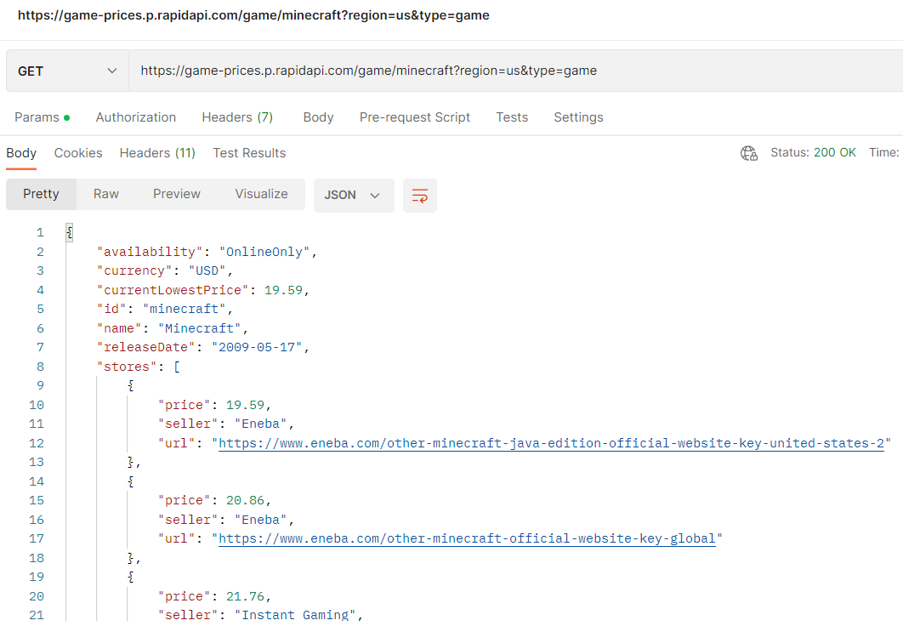

# Investigando Servicios para el Proyecto
Equipo 1

Año: 2022-2023

Módulo: PSP

## APIs seleccionadas:
* Video Game news: [https://rapidapi.com/JpBongiovanni/api/https://rapidapi.com/JpBongiovanni/api/video-game-news//](https://rapidapi.com/JpBongiovanni/api/video-game-news/)
* Epic Games store: [https://rapidapi.com/archergardinersheridan/api/steam-store-data](https://rapidapi.com/psimavel/api/epic-games-store)
* Game Prices: [https://rapidapi.com/SapphireWare/api/video-game-price/](https://rapidapi.com/wim.onderbeke/api/game-prices)

## Video Game news
Ofrece los siguientes endpoints, con la restricción de que se tiene que estar suscrito para utilizarlas:

### GET all articles from all sources: Busca los datos de todos los articulos y los muertra.

#### CURL de ejemplo:
``` shell
curl --request GET \
	--url https://video-game-news.p.rapidapi.com/all \
	--header 'X-RapidAPI-Host: video-game-news.p.rapidapi.com' \
	--header 'X-RapidAPI-Key: d91b7432femsh5a3909c96d9861bp1f4ebbjsn7dbdb34d7a10'
```

#### Implementación Java:
``` java
HttpRequest request = HttpRequest.newBuilder()
		.uri(URI.create("https://video-game-news.p.rapidapi.com/all"))
		.header("X-RapidAPI-Key", "d91b7432femsh5a3909c96d9861bp1f4ebbjsn7dbdb34d7a10")
		.header("X-RapidAPI-Host", "video-game-news.p.rapidapi.com")
		.method("GET", HttpRequest.BodyPublishers.noBody())
		.build();
HttpResponse<String> response = HttpClient.newHttpClient().send(request, HttpResponse.BodyHandlers.ofString());
System.out.println(response.body());
```

#### Prueba:


### GET All articles from a specific source

#### CURL de ejemplo:
``` shell
curl --request GET \
	--url https://video-game-news.p.rapidapi.com/%7BsourceId%7D \
	--header 'X-RapidAPI-Host: video-game-news.p.rapidapi.com' \
	--header 'X-RapidAPI-Key: d91b7432femsh5a3909c96d9861bp1f4ebbjsn7dbdb34d7a10'
```

#### Implementación Java:
``` java
HttpRequest request = HttpRequest.newBuilder()
		.uri(URI.create("https://video-game-news.p.rapidapi.com/%7BsourceId%7D"))
		.header("X-RapidAPI-Key", "d91b7432femsh5a3909c96d9861bp1f4ebbjsn7dbdb34d7a10")
		.header("X-RapidAPI-Host", "video-game-news.p.rapidapi.com")
		.method("GET", HttpRequest.BodyPublishers.noBody())
		.build();
HttpResponse<String> response = HttpClient.newHttpClient().send(request, HttpResponse.BodyHandlers.ofString());
System.out.println(response.body());
```



### GET Article from a specific source

#### CURL de ejemplo:
``` shell
curl --request GET \
	--url https://video-game-news.p.rapidapi.com/pokemon \
	--header 'X-RapidAPI-Host: video-game-news.p.rapidapi.com' \
	--header 'X-RapidAPI-Key: d91b7432femsh5a3909c96d9861bp1f4ebbjsn7dbdb34d7a10'
```

#### Implementación Java:
``` java
HttpRequest request = HttpRequest.newBuilder()
		.uri(URI.create("https://video-game-news.p.rapidapi.com/pokemon"))
		.header("X-RapidAPI-Key", "d91b7432femsh5a3909c96d9861bp1f4ebbjsn7dbdb34d7a10")
		.header("X-RapidAPI-Host", "video-game-news.p.rapidapi.com")
		.method("GET", HttpRequest.BodyPublishers.noBody())
		.build();
HttpResponse<String> response = HttpClient.newHttpClient().send(request, HttpResponse.BodyHandlers.ofString());
System.out.println(response.body());
```



## Epic Games store
Ofrece los siguientes endpoints, con la restricción de que se tiene que estar suscrito para utilizarlas:

### GET Search: Busca los datos de un juego y los muestra.

#### CURL de ejemplo: 
``` shell
curl --request GET \
	--url https://epic-games-store.p.rapidapi.com/search/fortnite/page/1/country/US/locale/en \
	--header 'X-RapidAPI-Host: epic-games-store.p.rapidapi.com' \
	--header 'X-RapidAPI-Key: 08dab370bamshe9d8629a3882b9cp1cfb9ejsnac299ca7c162'
```

#### Implementación Java:
``` java
HttpRequest request = HttpRequest.newBuilder()
		.uri(URI.create("https://epic-games-store.p.rapidapi.com/search/fortnite/page/1/country/US/locale/en"))
		.header("X-RapidAPI-Key", "08dab370bamshe9d8629a3882b9cp1cfb9ejsnac299ca7c162")
		.header("X-RapidAPI-Host", "epic-games-store.p.rapidapi.com")
		.method("GET", HttpRequest.BodyPublishers.noBody())
		.build();
HttpResponse<String> response = HttpClient.newHttpClient().send(request, HttpResponse.BodyHandlers.ofString());
System.out.println(response.body());
```

#### Prueba:


### GET Get News: Muestra noticias de la plataforma.

#### CURL de ejemplo:
``` shell
curl --request GET \
	--url https://epic-games-store.p.rapidapi.com/getNews/locale/en/limit/30 \
	--header 'X-RapidAPI-Host: epic-games-store.p.rapidapi.com' \
	--header 'X-RapidAPI-Key: 08dab370bamshe9d8629a3882b9cp1cfb9ejsnac299ca7c162'
```

#### Implementación Java:
``` java
HttpRequest request = HttpRequest.newBuilder()
		.uri(URI.create("https://epic-games-store.p.rapidapi.com/getNews/locale/en/limit/30"))
		.header("X-RapidAPI-Key", "08dab370bamshe9d8629a3882b9cp1cfb9ejsnac299ca7c162")
		.header("X-RapidAPI-Host", "epic-games-store.p.rapidapi.com")
		.method("GET", HttpRequest.BodyPublishers.noBody())
		.build();
HttpResponse<String> response = HttpClient.newHttpClient().send(request, HttpResponse.BodyHandlers.ofString());
System.out.println(response.body());
```

#### Prueba:


### GET Get free games: Muestra una lista de los juegos gratis actuales.

#### CURL de ejemplo:
``` shell
curl --request GET \
	--url https://epic-games-store.p.rapidapi.com/getFreeGames/country/US/locale/en \
	--header 'X-RapidAPI-Host: epic-games-store.p.rapidapi.com' \
	--header 'X-RapidAPI-Key: 08dab370bamshe9d8629a3882b9cp1cfb9ejsnac299ca7c162'
```

#### Implementación Java:
``` java
HttpRequest request = HttpRequest.newBuilder()
		.uri(URI.create("https://epic-games-store.p.rapidapi.com/getFreeGames/country/US/locale/en"))
		.header("X-RapidAPI-Key", "08dab370bamshe9d8629a3882b9cp1cfb9ejsnac299ca7c162")
		.header("X-RapidAPI-Host", "epic-games-store.p.rapidapi.com")
		.method("GET", HttpRequest.BodyPublishers.noBody())
		.build();
HttpResponse<String> response = HttpClient.newHttpClient().send(request, HttpResponse.BodyHandlers.ofString());
System.out.println(response.body());
```

#### Prueba:


## Games Price
Ofrece los siguientes endpoints, con la restricción de que se tiene que estar suscrito para utilizarlas:

### GET Get Regions: Obtiene todas las regiones disponibles para su uso en esta API.

#### CURL de ejemplo:
``` shell
curl --request GET \
	--url https://game-prices.p.rapidapi.com/regions \
	--header 'X-RapidAPI-Host: game-prices.p.rapidapi.com' \
	--header 'X-RapidAPI-Key: 45aa08241cmsh76c4b52da44a492p132fb9jsn4a4d8fde628c'
```

#### Implementación Java:
``` java
HttpRequest request = HttpRequest.newBuilder()
		.uri(URI.create("https://game-prices.p.rapidapi.com/regions"))
		.header("X-RapidAPI-Key", "45aa08241cmsh76c4b52da44a492p132fb9jsn4a4d8fde628c")
		.header("X-RapidAPI-Host", "game-prices.p.rapidapi.com")
		.method("GET", HttpRequest.BodyPublishers.noBody())
		.build();
HttpResponse<String> response = HttpClient.newHttpClient().send(request, HttpResponse.BodyHandlers.ofString());
System.out.println(response.body());
```

#### Prueba:


### GET Get Games: Obtiene todos los juegos con los parámetros de consulta proporcionados. La región dada determina la moneda en la que verá los resultados. Se realiza una búsqueda aproximada sobre el título. La paginación es posible usando los parámetros limit y offset.

#### CURL de ejemplo:
``` shell
curl --request GET \
	--url 'https://game-prices.p.rapidapi.com/games?title=minecraft&region=us&offset=0&limit=10' \
	--header 'X-RapidAPI-Host: game-prices.p.rapidapi.com' \
	--header 'X-RapidAPI-Key: 45aa08241cmsh76c4b52da44a492p132fb9jsn4a4d8fde628c'
```

#### Implementación Java:
``` java
HttpRequest request = HttpRequest.newBuilder()
		.uri(URI.create("https://game-prices.p.rapidapi.com/games?title=minecraft&region=us&offset=0&limit=10"))
		.header("X-RapidAPI-Key", "45aa08241cmsh76c4b52da44a492p132fb9jsn4a4d8fde628c")
		.header("X-RapidAPI-Host", "game-prices.p.rapidapi.com")
		.method("GET", HttpRequest.BodyPublishers.noBody())
		.build();
HttpResponse<String> response = HttpClient.newHttpClient().send(request, HttpResponse.BodyHandlers.ofString());
System.out.println(response.body());
```

#### Prueba:


### GET Get Game: Obtiene un juego por su id. La identificación se puede encontrar utilizando el punto final /games y realizando una búsqueda aproximada, pero a menudo será la versión en minúsculas del nombre del juego separada por líneas discontinuas en lugar de espacios. La región determina la moneda en la que se convertirán los precios. El tipo determina si el producto es un juego, dlc, aplicación o paquete.

#### CURL de ejemplo:
``` shell
curl --request GET \
	--url 'https://game-prices.p.rapidapi.com/game/minecraft?region=us&type=game' \
	--header 'X-RapidAPI-Host: game-prices.p.rapidapi.com' \
	--header 'X-RapidAPI-Key: 45aa08241cmsh76c4b52da44a492p132fb9jsn4a4d8fde628c'
```

#### Implementación Java:
``` java
HttpRequest request = HttpRequest.newBuilder()
		.uri(URI.create("https://game-prices.p.rapidapi.com/game/minecraft?region=us&type=game"))
		.header("X-RapidAPI-Key", "45aa08241cmsh76c4b52da44a492p132fb9jsn4a4d8fde628c")
		.header("X-RapidAPI-Host", "game-prices.p.rapidapi.com")
		.method("GET", HttpRequest.BodyPublishers.noBody())
		.build();
HttpResponse<String> response = HttpClient.newHttpClient().send(request, HttpResponse.BodyHandlers.ofString());
System.out.println(response.body());
```

#### Prueba:
