# Documentación del proyecto
Equipo 1

Año: 2022-2023

Módulo: PSP

## [Codificación-1] Implementando los usuarios

### Informe de CUs realizados

Referenciando al previo hito, los CUs realizados en esta iteración son los siguientes:
* [CU-03] Crear cuenta de empleado: A través de la petición POST de /appVGShop/employee.
* [CU-04] Listar empleados: A través de la petición GET de /appVGShop/employee/getAll.
* [CU-05] Comprobar datos de un empleado: A través de la petición GET de /appVGShop/employee/getUser/{id}.
* [CU-06] Actualizar empleado: A través de la petición PUT de /appVGShop/employee/updateUser/{id}.
* [CU-07] Borrar empleado: A través de la petición DELETE de /appVGShop/employee/deleteUser/{id}.
* [CU-08] Cambiar puesto a un empleado: De la misma manera que CU-06. Debe modificarse su acceso en el entorno gráfico.
* [Resto de los CUs] Sin progreso.

Detalle: Al no tener en cuenta una capa de servicio o una integración gráfica, el orden de algunos de estos CUs o su acceso es distinto a como está intencionado en la aplicación final.

### Explicación de Anotaciones

#### Spring

* @SpringBootApplication: Esta anotación se usa en la clase de aplicación al configurar un proyecto Spring Boot.
  La clase que se anota con el @SpringBootApplication debe mantenerse en el paquete base.
  La única cosa que el @SpringBootApplication hace es un escaneo de componentes.
  Pero escaneará solo sus sub paquetes.


* @Configuration: La anotación es parte del marco Spring Core.
  La anotación indica que la clase tiene métodos de definición de @Bean.
  Con esta, el contenedor Spring puede procesar la clase y generar Spring Beans para usar en la aplicación.

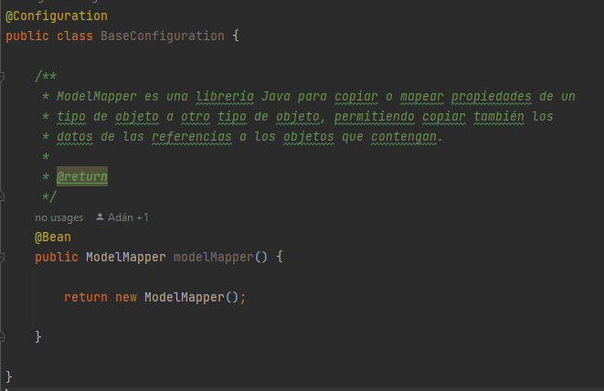

* @Bean: Esta anotación se utiliza en el nivel del método.
  @Bean es una anotación que funciona con @Configuration para crear beans en Spring.
  Como se mencionó anteriormente, @Configuration tendrá métodos para instanciar y configurar dependencias.
  Tales métodos serán anotados con @Bean.
  El método anotado con esta anotación funciona como ID del bean y genera y devuelve el bean real.

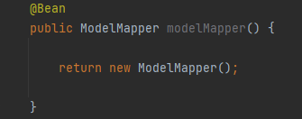

* @Component: Esta anotación se usa en las clases para indicar un componente Spring.
  La anotación marca la clase Java como un bean o un componente de modo que el mecanismo de escaneo de componentes de Spring pueda agregarse al contexto de la aplicación.

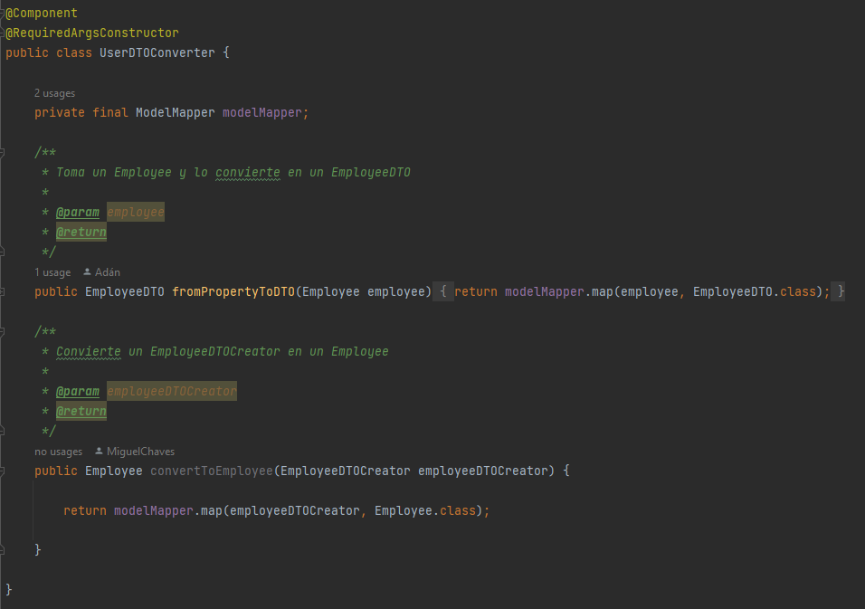

* @RestController: La anotación marca la clase como un controlador donde cada método devuelve un objeto de dominio en lugar de una vista.

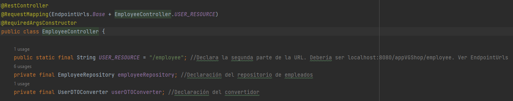

* @RequestMapping: Indica la url bajo la cual se publicará el controlador.


* @GetMapping: La anotación se utiliza para asignar solicitudes HTTP GET a métodos de controlador específicos.

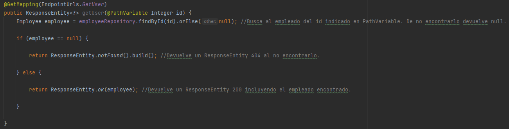

* @PathVariable: La anotación se utiliza para anotar los argumentos del método del controlador de solicitudes.


* @PostMapping: La anotación se utiliza para asignar solicitudes HTTP POST a métodos de controlador específicos.

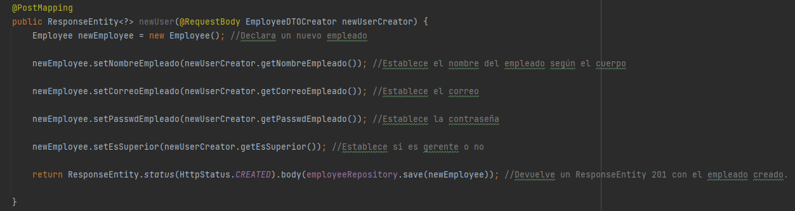

* @RequestBody: La anotación se utiliza para anotar los argumentos del método del controlador de solicitudes.


* @PutMapping: La anotación se utiliza para asignar solicitudes HTTP PUT a métodos de controlador específicos.

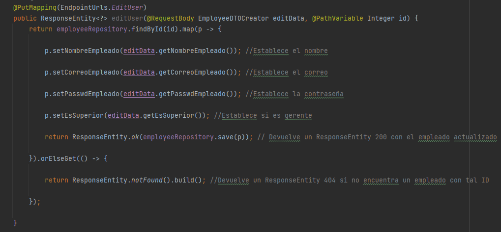

* @DeleteMapping: La anotación se utiliza para mapear solicitudes HTTP DELETE en métodos de controlador específicos.

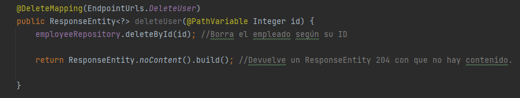

* ResponseEntity<?>: Es una extensión de HttpEntity que añade el código HTTP de estado. Contiene la entidad indicada, pero también se le puede introducir un '?' para que identifique la clase de la entidad que debe tratar.

#### Lombok

* @RequiredArgsConstructor: Genera un constructor con todos los argumentos requeridos.
  Los argumentos obligatorios son campos finales y campos con restricciones como @NonNull.


* @NoArgsConstructor: Genera un constructor sin atributos.


* @AllArgsConstructor: Genera un constructor con todos los atributos.


* @Data: Es una anotación de acceso directo conveniente que agrupa las características
  de @ToString, @EqualsAndHashCode, @Getter, @Setter y @RequiredArgsConstructor juntas.


* @Getter y @Setter: Se generan un getter y un setter para todos los atributos. No se generan setter para atributos finales.


* @ToString: Introduce el toString base que podría tener una clase con todos sus atributos.
* @EqualsAndHashCode: Introduce los métodos de "equals(La misma clase)" y "hashCode()".

#### Jakarta

* @Entity: Es la persistencia de objetos almacenados como registros en la base de datos.

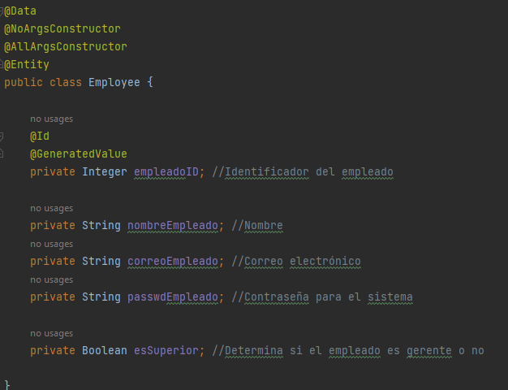

* @Id: La anotación se utiliza para determinar el ID de una entidad, aplicándola sobre la propiedad que sería el ID de la entidad.


* @GeneratedValue: La anotación se emplea a una propiedad o campo de clave principal de una entidad o superclase correlacionada junto con la anotación @Id.


### Inversión de dependencias

Utilizando Spring y el sistema de anotaciones se ha logrado que el sistema pueda declarar las entidades necesarias para la aplicación sin necesidad que fuera esto hecho explícitamente.
En este hito podemos ver que el controlador que maneja las peticiones no es declarado en ninguna otra parte exceptuando en su propia clase, con la anotación @RestController.
Spring hace el resto del trabajo por nosotros, declarándolo e instanciándolo una única vez, dándole acceso al controlador a todas las clases de la aplicación que lo necesitaran y evitando que tuviéramos que declarar tal cosa en explícitamente.

La entidad de persistencia que se está tratando en esta iteración es Employee.
En la clase Employee se ha utilizado la anotación @Entity del paquete jakarta.persistence.
Esto es lo único que nos hace falta para que el sistema lo reconozca como una entidad que requiere persistencia, creando tablas en las bases de datos que fuéramos a usar y permitiendo fácil acceso al usar JPA.

### Pruebas con Postman

Añadiendo unos pocos usuarios (Añado 3 más de los mostrados):


Mostrando todos los usuarios:

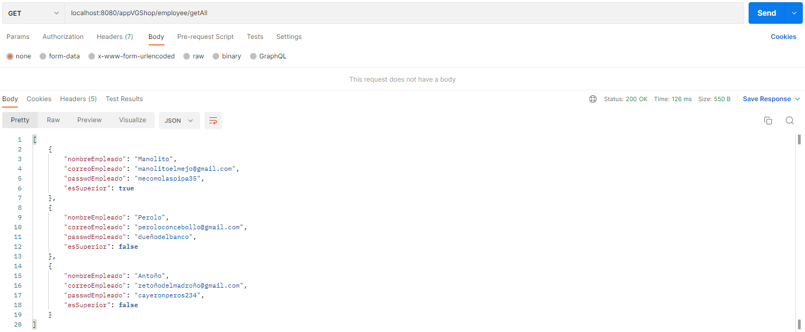

Mostrando un solo usuario:

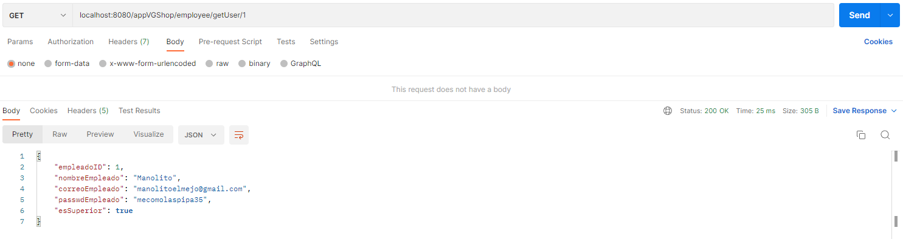

Editando usuario 1:

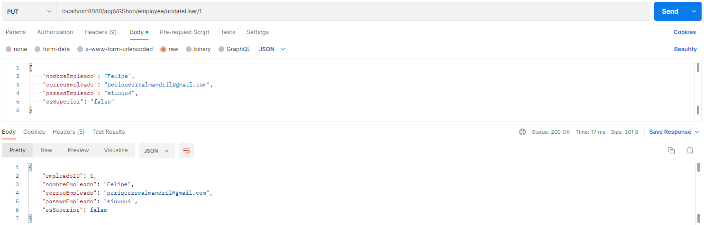

Borrando usuario 2:

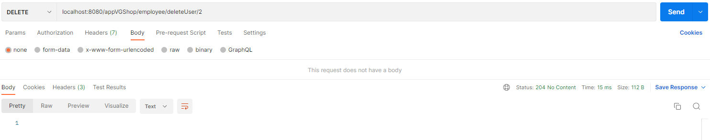

Todos los cambios realizados con Postman son realizados también en la base de datos H2 a través de JPA.

### DTO y Conversor

En el hito de Codificación-1, tenemos tanto una clase Employee como un EmployeeDTO que muestra sus datos con atributos simplificados.
Este conserva la id por facilidad de parseo o conversión.
Aparte de esto, tenemos una serie de clases DTO de Employee como el Creator que nos sirven para poder tener otros tipos de "cuerpo" para las peticiones.
Por ejemplo con EmployeeDTOCreator, no se pide un 'id' en ningún momento, ya que es la base de datos la que asigna este atributo.

El conversor, de clase UserDTOConverter, utiliza ModelMapper para pasar Employee a su forma DTO y viceversa.
ModelMapper es un framework de objeto-a-objeto que convierte POJOs de una manera a la otra, automatizando los mapeos de objeto.
En el caso de la aplicación, no introducimos ninguna configuración extra, dependiendo de los nombres de los atributos para que ModelMapper los pueda detectar y enlazar.
Posteriormente a esto transforma la información de una clase a la otra, si sus tipos de atributo son compatibles (Como 'int' con 'Integer').

### Repositorio

#### Anotaciones para la persistencia

En la aplicación utilizamos anotaciones para la persistencia en base de datos: @Entity

Entity se asegura de que la aplicación de Spring detecte este componente como uno de los datos a mantener en las bases de datos, teniendo una serie de funciones automáticas base.
Cualquier entidad declarada de esta manera tendrá su tabla en las bases de datos, con los datos siendo afectados por otras anotaciones como @Id, @JoinColumn, entre otros.
A la hora de crear la tabla, se fijará en estas anotaciones para definir su PK, FKs que tuviese, conexiones entre tablas y demás; automatizando todo el proceso de creación de tablas o interpretación según JPA.

#### Capa de Repository

En la aplicación, la capa de 'repository' (dentro de infraestructura) es compuesta por las interfaces e implementación de estas extendiendo JPARepository.
Al hacer referencia a los métodos de la interfaz, nos estamos refiriendo en realidad a los métodos extendidos de JPARepository, que a su misma vez extiende los métodos de ListCrudRepository, ListPagingAndSortingRepository y QueryByExampleExecutor.
Estos métodos son aquellos que utilizamos para acceder a la base de datos de por sí.

#### Maven: Dependencias de JPA

Para poder acceder a las funciones de JPA, lo hemos hecho mediante la siguiente dependencia en el pom.xml:

```
<dependency>
    <groupId>org.springframework.boot</groupId>
    <artifactId>spring-boot-starter-data-jpa</artifactId>
    <version>3.0.0</version>
</dependency>
```

Maven se puede encargar de descargar estas dependencias fácilmente. La mostrada arriba la pudimos encontrar sin mucho problema en https://mvnrepository.com/

### H2

#### Dependencia Maven

Declarado en el pom.xml:

```
<dependency>
    <groupId>com.h2database</groupId>
    <artifactId>h2</artifactId>
    <version>2.1.214</version>
    <scope>runtime</scope>
</dependency>
```

Posteriormente descargado por Maven para la aplicación. (Clic derecho -> Maven -> Download Sources)

#### Configuración en application.properties

Este es el contenido del archivo application.properties para la conexión con H2.

```
spring.datasource.url=jdbc:h2:mem:proyectopsp 
    #Establece que sea una base de datos en memoria, además de un nombre para esta para el acceso posterior por la consola gráfica.
spring.datasource.driverClassName: org.h2.Driver
    #Se indica que se utiliza el driver de h2
spring.datasource.username: sa
    #Se indica el nombre de usuario base para el acceso
spring.datasource.password:
    #En nuestro caso, lo dejamos sin contraseña, aunque esto puede suponer fallas de seguridad
spring.jpa.database-platform: org.hibernate.dialect.H2Dialect
    #Conexión con las funciones de Hibernate
spring.h2.console.enabled: true
    #Permite que accedamos a la consola gráfica, que nos permitirá ver la base de datos más directamente
```

#### Pruebas en H2

Primero lanzamos la aplicación y comprobamos que no haya errores de ejecución.


Luego abrimos la consola de h2, para realizar las comprobaciones con la aplicación.


Realizamos un select para comprobar que la conexión se ha realizado correctamente.


Realizamos un insert para comprobar que los campos automáticamente creados son correctos


Realizamos un select para comprobar que el nuevo dato se ha introducido correctamente.


Realizamos un update para comprobar que el método funciona correctamente.


Realizamos un select para visualizar que el cambio se ha realizado correctamente.


Realizamos un delete para visualizar que el dato se ha eliminado correctamente.


Realizamos un select para visualizar que la eliminación se ha realizado correctamente.


#### Pruebas en MySQL y PHPMyAdmin

Primero lanzamos la aplicación, tras abrir el contenedor de MYSQL y phpMyAdmin, y comprobamos que no haya errores de ejecución.


Luego lanzamos mysql en el terminal o consola, para verificar que la tabla existe.


Realizamos un select desde phpMyAdmin para comprobar que la conexión se ha realizado correctamente.


Realizamos un insert para comprobar que los campos automáticamente creados son correctos


Realizamos un update para comprobar que el método funciona correctamente y realizamos un select para comprobar que el nuevo dato se ha introducido correctamente.


Realizamos un delete y un select para visualizar que el dato se ha eliminado correctamente.


