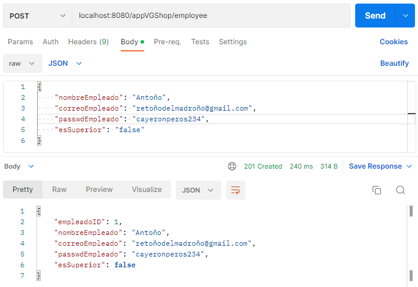
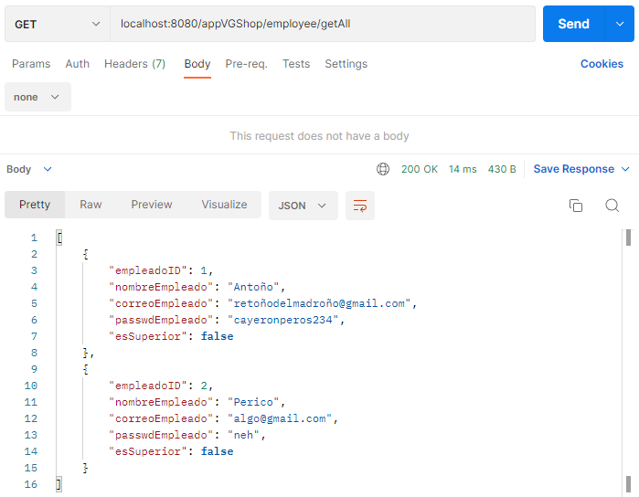
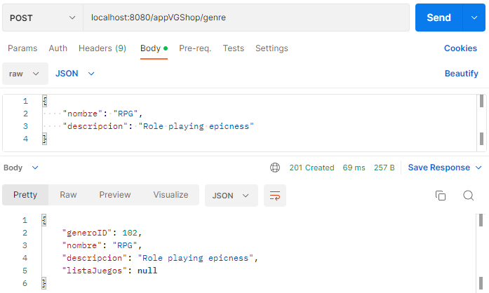
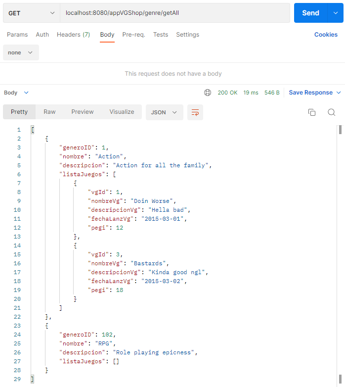
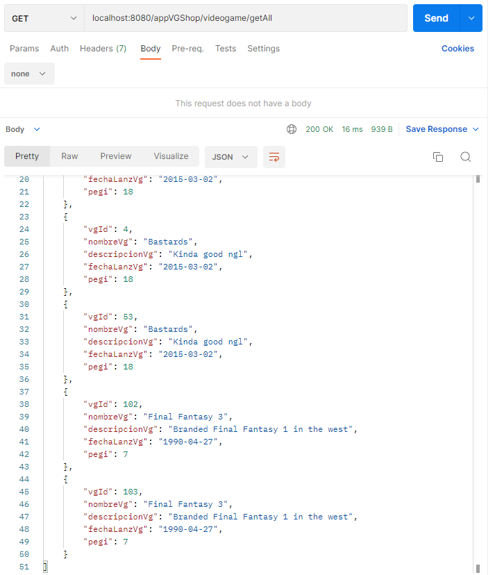

# Documentación del proyecto
Equipo 1

Año: 2022-2023

Módulo: PSP

## [Codificación-2] Requisitos funcionales 1/2 con app dockerizada

### Cambios mayores

* Implementación de capa servicio a todas las gestiones del sistema. Realiza conversión DTO cuando es necesario.
* Conversores movidos a la capa de servicio.

### Pruebas con Postman

#### GESTIÓN DE EMPLEADOS

Habrá más información en el código de cómo funciona cada uno de los métodos.

Creando un empleado:

Viendo todos los empleados:

Tomando un solo empleado:

Editando un empleado:

Borrando un empleado:

----

#### GESTIÓN DE GÉNEROS

Género tiene una lista con los videojuegos que le pertenecen. Cuando un videojuego se edita o borra, este desaparece de la lista del género.
De base, los géneros no tienen ningún juego en su lista. Si un género se borra, los juegos dentro de él también.

Creando un género:

Viendo todos los géneros:

Tomando un solo género:

Editando la descripción de un género:

Borrando un género:

----

#### GESTIÓN DE VIDEOJUEGOS

Los videojuegos al crearse deben pertenecer a un género el cual es indicado en el path.

Creando un juego:

Mostrando todos los juegos independientemente de género (Aparecen duplicados por testeo previo):

Mostrando info de un juego específico:

Editando la info de un juego:

Borrando un juego:

Mostrando los géneros con juegos añadidos:

----

### Explicación DTOs

El sistema cuenta a lo largo de sus tres gestiones con dos tipos de DTO que se ven prevalentemente:

* El DTO normal, cuyos objetos usaremos para mantener la información de estos sin tener que estar acudiendo constantemente al repositorio. Aparte, servirá como una manera de desacoplar estos objetos de la capa de servicio.
* El DTO de creación, el cual usamos como esquema para poder enviar cuerpos de información json a través de las peticiones. Mantienen los datos justos y necesarios, evitando los ID que sean autogenerados (puesto que resultaría irrelevante una vez llegase al sistema).

El paso de un tipo de objeto a otro (VO a DTO y viceversa) ocurre a través de los convertidores, que se encuentran en la capa de aplicación. Utilizan el ModelMapper para mapear las clases y automáticamente transmutarlas.