# Documentación del proyecto
Equipo 1

Año: 2022-2023

Módulo: PSP

## [Codificación-3] Microservicios

### Cambios mayores

* Reestructuración de las gestiones para mayor comprensibilidad.
* Separación de las gestiones en distintos microservicios.

### Configuración de microservicios

Mostrando la configuración de cada application.yml

#### GESTIÓN DE EMPLEADOS

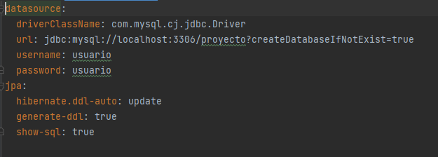

#### GESTIÓN DE GÉNEROS

#### GESTIÓN DE VIDEOJUEGOS

#### GESTIÓN DE ITEMS

### Comparativa de estructura

#### PREVIA ESTRUCTURA

Todos en el mismo proyecto, funcionando como una sola aplicación Spring.

#### ESTRUCTURA ACTUAL

Dividida en distintos proyectos, mostrado aquí en la misma carpeta.

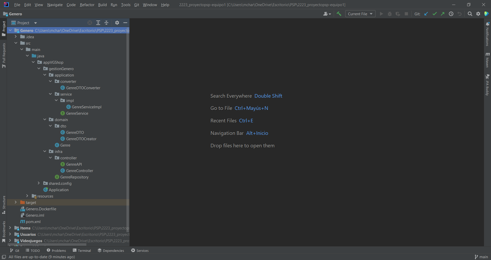

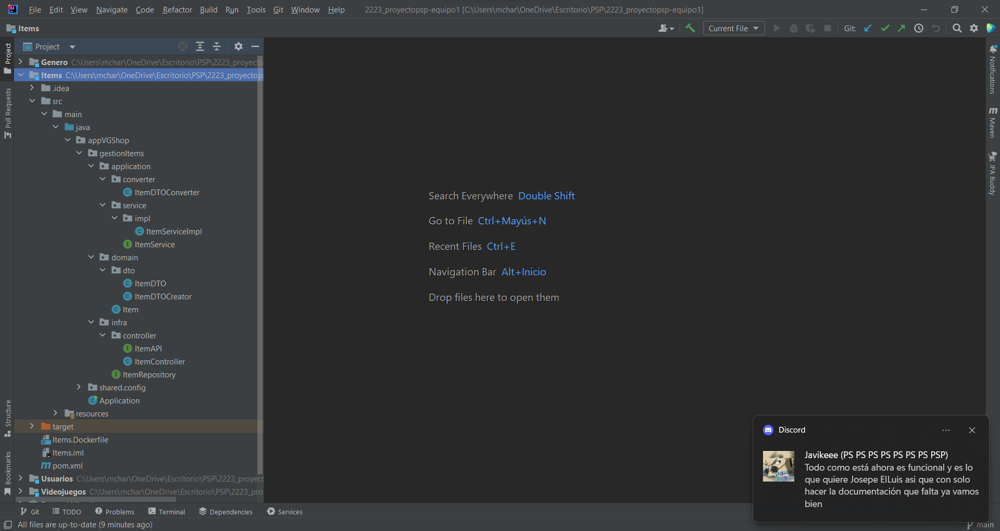

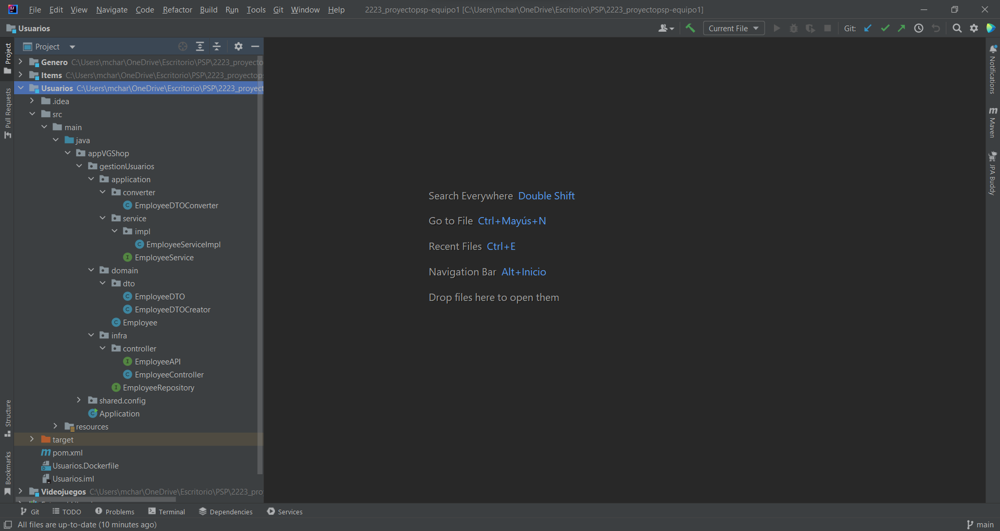

### Docker-compose

#### EXPLICACIÓN DEL FICHERO

#### UTILIZACIÓN

### Pruebas de funcionamiento

#### GESTIÓN DE EMPLEADOS

Creando un empleado:

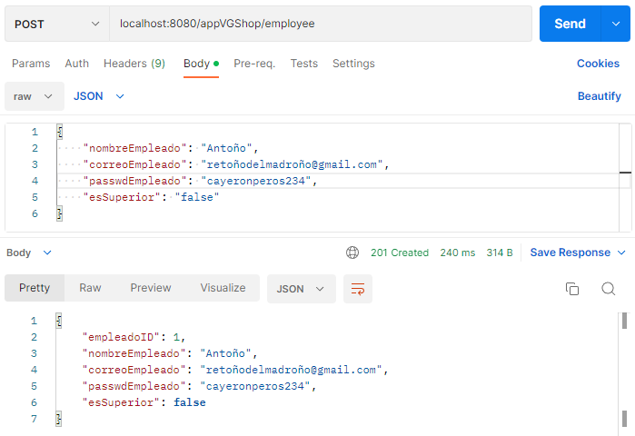

Viendo todos los empleados:

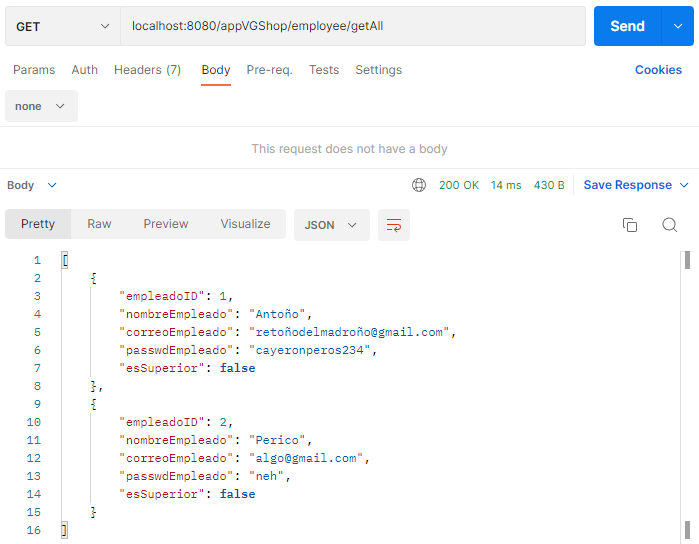

#### GESTIÓN DE GÉNEROS

Creando un género:

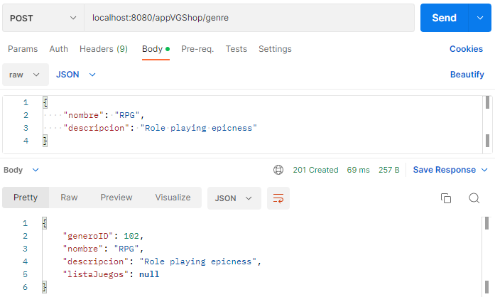

Viendo todos los géneros:

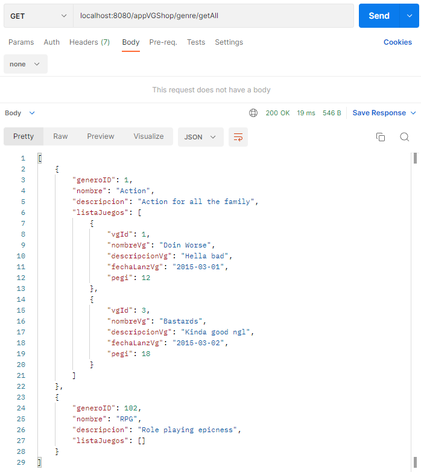

#### GESTIÓN DE VIDEOJUEGOS

Creando un juego:

Mostrando todos los juegos:

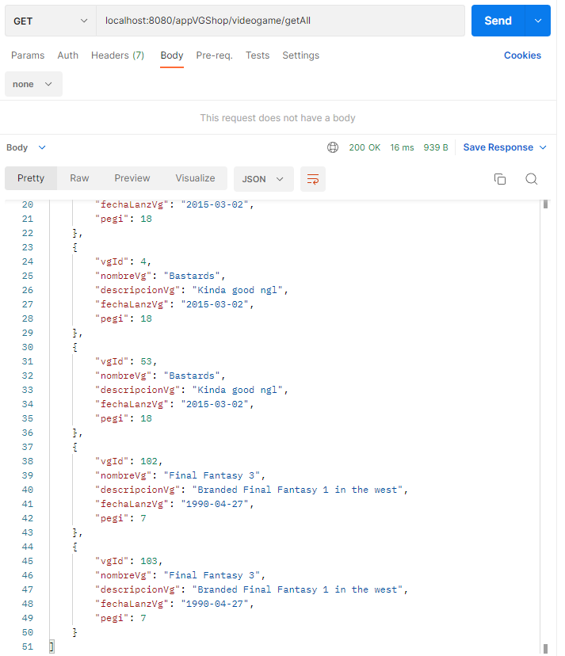

#### GESTIÓN DE ITEMS

Creando un item:

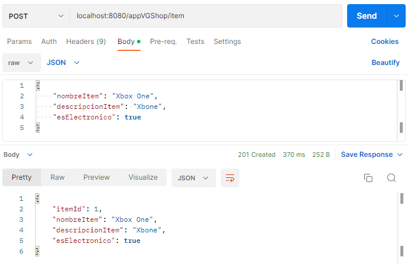

Mostrando todos los items:

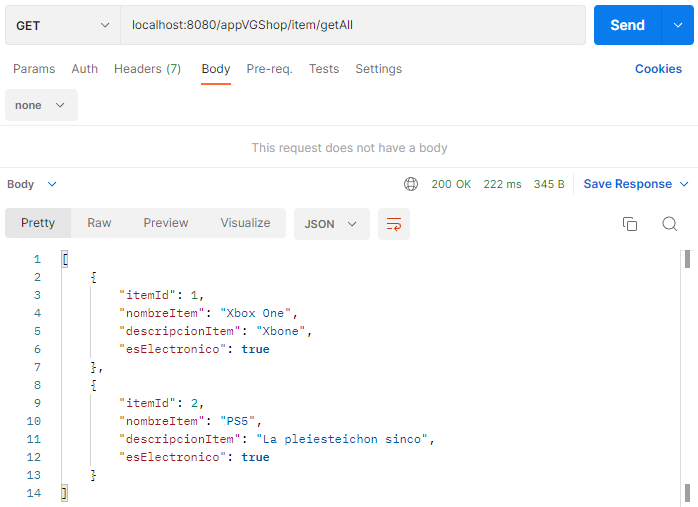